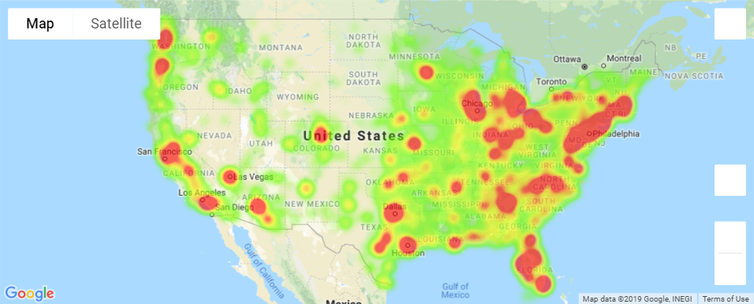
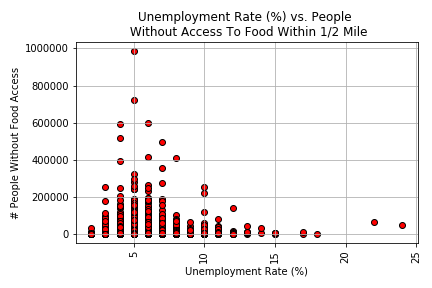
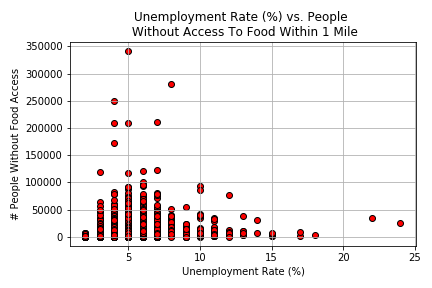
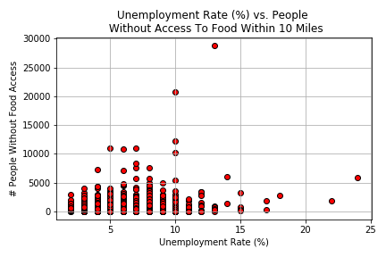
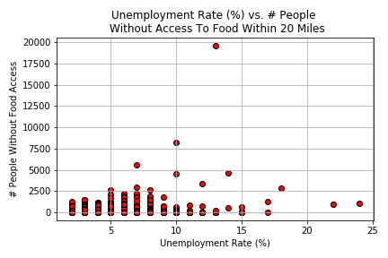
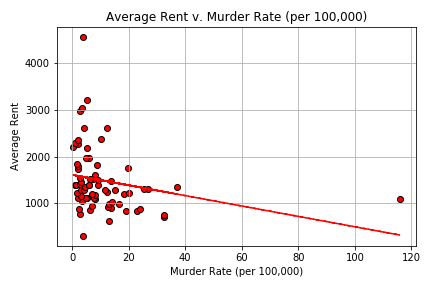

# Rent, Food Access and Murder - An analysis of living considerations in the US (2015)

  Our project was inspired by the question “where is the best place to live?” This question led us to evaluate everything from the frequency of extreme weather events, cost of living & rent, and  unemployment and crime rates. As we considered the data, we decide to focus on  food access, unemployment, murder rates, and rent averages.

## Hypothesis

  This project was a look into the main variables people think of when making a big move. We focused on finding complete datasets tow work on especially since the governemnt shutdown meant that a lot of data was now inaccessible.  A lot of the infromation we found centered around food access, average rent, murder rates and unemployment. Considering this, our main question hinged on relating access/affordability to safety and work opportunities in an area 

## Method

So, how did we go about proving/disproving our hypothesis? We used the following steps to find and clean up our data:
 - Found data using Kaggle, US Census Library, Zillow, & Google API [_Resources_]
 - Cleaned the data in order to whittle down what we actually needed
 - Merged files into dataframes using the county names as a common point
 - Loaded clean data files Jupyter Notebook
 - Plotted our data with Matplotlib and the Google Maps API
 - Ran a regression analysis to find correlations between our data
 - Discussed and analyzed our findings

## Comparison #1: Food Scarcity vs Unemployment Rates 

The reason behind our comparison of food scarcity and unemployment rates was to get a better idea of food access within an area as well as any potential relationship with unemployment. From our findings, we noticed that when unemployment rates decrease within an area, there is more access to food. 

_Figure 1: Heatmap illustrating unemployment rates across the US (2015)_ 

 
_Figure 2: Unemployment rates vs the population depending on their distance from a food source. These plots display the population within an urban area that are 0.5 miles or more,  and 1 mile or more away from food sources. P-Values: 0.349 (not correlated) & 0.00072 (correlated), respectively  (2015)_

Looking at Figure 1, areas with higher unemployment rates are shown in red while lower rates are shown in green or areas with no colour layer. Looking at the comparison of unemployment and food access in a urban areas, we do notice that as unemployment rates increase, the number of people without access to food decreases.  Following analysis, we did find that there was no correlation for the comparison using access ½ mile or more, while there could be a correlation between a comparison of unemployment rates and food access a mile or more.

 
_Figure 3: Unemployment rates vs the population depending on their distance from a food source. These plots display the population within a rural area that are 10 miles or more,  and 20 mile or more away from food sources. P-Value: 1.023e-20 (correlated) & 2.617e-08 (correlated), respectively  (2015)_

	 
For Figure 3, we analysed the same comparison of unemployment rates and food access but instead looked at food access of 10 miles or more and 20 miles or more in rural areas. The general trend we observed was that increases in unemployment rates were linked with a decrease in the number of people without access to food.

### Final thoughts:
Our findings suggest that the number of people without access to food is highest in counties with low unemployment figures. We determined that the following reasons could be a potential explanation for the observation:
 - As people become unemployed, they may move closer to food
 - The census data (where we pulled the unemployment figures) is incomplete: many impoverished people may not have been included in the census or may have declined to answer
 - Unemployment rates in cities tend to be lower than the rates seen in rural areas. This could be a result of the greater number of opportunities and population density

## Comparison #2: Unemployment Rates vs Crime Rates
Our second comparison evaluates unemployment rates and crime rates. We decided to pursue this comparison in order to potentially evaluate safety and living costs. You can find our data displayed in Figure 4. We found that the areas with higher unemployment matched cities with higher murder rates.

.png)
_Figure 4: Heatmap illustrating unemployment rates across the US against major cities with the highest murder rates  (2015)_ 

### Final Thoughts:
During our analysis, we found that areas with higher unemployment rates did show a connection to cities with higher murder rates. We discussed the finds and came up with the following possible explanations:
 - The census data (where we pulled the unemployment figures) may be incomplete
 - As people become unemployed, they become more desperate and may resort to crime
 - Crime rates in cities tend to be higher than those in rural areas
 - Murder rate is higher on the east coast in comparison to the west coast

## Comparison #3: Rent vs Crime Rates

_Figure 5: Average rent versus murder rates within specific cities (2015)_

Typically cities that have high crime rates have a lower average rent in the city. The rent prices tend to be cheaper since people are less willing to  move to an area with high crime rates, pushing rent down.

### Final Thoughts:
From our observations we noticed that violent crimes could be noted as more frequent in lower rent areas. Our possible explanations for this observation are as follows:
 - More lower income people move to low rent areas
 - As rent increases, violent crime rate decreases
 - Lack of resources leads to fewer opportunities, which increases crime
 
 ## Overall considerations
 
  - Further research will be required to better understand these results
 - Our data is limited - we’re only looking at a single year (2015) rather than a trend over several years
 - The census data may be incomplete - impoverished people are less likely to fill out the census than those with resources. Since having an accurate measure of impoverished people is core to our study, this presents a problem
 - It’s difficult to compare these two datasets, since they include city data (average rent & murder rates) and county data (unemployment rate & food access)
 
 ## Resources
 
 - Kaggle homicide data: (https://www.kaggle.com/jyzaguirre/us-homicide-reports)
 - Kaggle unemployment data: https://www.kaggle.com/jayrav13/unemployment-by-county-us)
 - USDA Food Access data: https://www.ers.usda.gov/data-products/food-access-research-atlas/download-the-data/
 - Zillow Rent data: https://www.zillow.com/research/data/
 - US Census data: https://www.census.gov/support/USACdataDownloads.html
